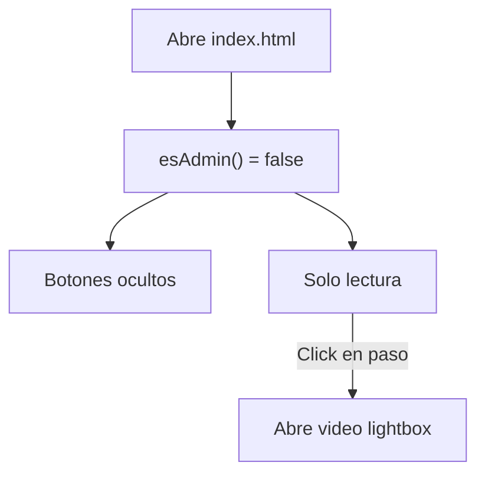
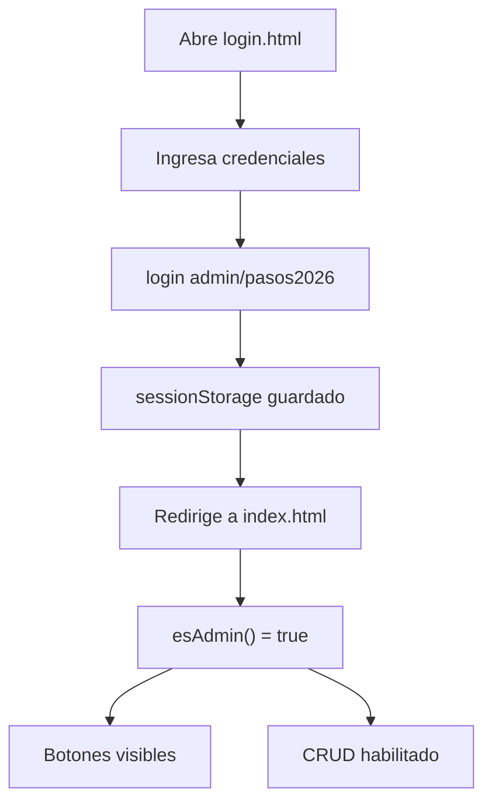

# 🏗️ Arquitectura de Módulos - Pasos de Danza

## Estructura General

```
Pasos de Danza
│
├── 👥 MÓDULO PÚBLICO (Lectura)
│   ├── index.html (Página principal)
│   ├── auth.js (Sistema de autenticación)
│   ├── app.js (Lógica compartida - renderizado)
│   └── styles.css (Estilos compartidos)
│
└── 👨‍💼 MÓDULO ADMIN (Lectura + Escritura)
    ├── login.html (Página de login)
    └── (Acceso protegido mediante auth.js)
```

---

## 📊 Flujo de Acceso

### Usuario Público (Sin Login)
```
1. Abre index.html
2. esAdmin() = false
3. Ve:
   ✅ Lista de pasos
   ✅ Botones de reproducción (lightbox)
   ❌ Botones de agregar/editar/eliminar
4. No puede hacer cambios
```

### Usuario Admin (Con Login)
```
1. Abre login.html
2. Ingresa: admin / pasos2026
3. login() → sessionStorage
4. Redirige a index.html
5. esAdmin() = true
6. Ve:
   ✅ Lista de pasos
   ✅ Botones de reproducción (lightbox)
   ✅ Botones de agregar/editar/eliminar
   ✅ Indicador "Modo: Admin" en header
7. Puede hacer cambios
8. Botón "Cerrar Sesión" → logout()
```

---

## 🔐 Sistema de Autenticación

### Archivos Involucrados

#### 1. **auth.js** (Core)
Contiene toda la lógica de autenticación:

```javascript
// Verificar estado
esAdmin() → boolean
obtenerUsuarioActual() → { isAdmin, usuario }

// Operaciones
login(usuario, contrasena) → boolean
logout() → void
actualizarVisibilidadBotones() → void
```

**Almacenamiento**: `sessionStorage['auth']`

#### 2. **login.html** (Punto de Entrada Admin)
- Formulario de login bonito y funcional
- Valida credenciales contra auth.js
- Redirige a index.html si login es exitoso
- Muestra credenciales demo en la página

#### 3. **index.html** (Página Principal)
Integración de autenticación:

```html
<!-- Header dinámico -->
<div class="header-left">
  <h1>Pasos de Danza</h1>
  <span id="user-info">Modo: <strong id="user-name">Admin</strong></span>
</div>

<!-- Botones protegidos -->
<button id="btn-agregar-paso">+ Agregar Paso</button>
<button id="btn-logout">Cerrar Sesión</button>
```

#### 4. **app.js** (Lógica Protegida)
Cada función sensible verifica `esAdmin()`:

```javascript
function openModal() {
  if (!esAdmin()) {
    alert('Solo administradores pueden agregar pasos');
    return;
  }
  // ... código
}

function openEditModal(pasoId) {
  if (!esAdmin()) {
    alert('Solo administradores pueden editar pasos');
    return;
  }
  // ... código
}

function deletePaso(pasoId) {
  if (!esAdmin()) {
    alert('Solo administradores pueden eliminar pasos');
    return;
  }
  // ... código
}

// En la carga de página
if (user && user.isAdmin) {
  document.getElementById('user-info').style.display = 'inline-block';
  document.getElementById('btn-logout').style.display = 'inline-block';
}
```

---

## 🚀 Flujo de Trabajo

### Para Usuario Público



### Para Usuario Admin



---

## 📁 Archivos Clave

| Archivo | Lenguaje | Propósito | Protegido |
|---------|----------|-----------|-----------|
| auth.js | JavaScript | Lógica de autenticación | N/A |
| login.html | HTML/CSS/JS | Página de login | ✅ |
| index.html | HTML | Página principal | Parcial |
| app.js | JavaScript | Lógica de aplicación | ✅ |
| styles.css | CSS | Estilos globales | N/A |

---

## 🔒 Protecciones Implementadas

### Front-end (Visible para Usuario)
```javascript
✅ Botones ocultos si no es admin
✅ Alertas al intentar acciones protegidas
✅ Indicador visual de sesión activa
```

### JavaScript (Prevención Básica)
```javascript
✅ Funciones verifican esAdmin()
✅ Operaciones CRUD bloqueadas sin auth
✅ Credenciales validadas antes de guardar sesión
```

### Base de Datos (Seguridad Real)
```
⚠️ Firebase Firestore debe tener reglas de seguridad
   (Aún no implementadas - ver "Próximos Pasos")
```

---

## ⚠️ Limitaciones Actuales (MVP)

En esta versión:

1. **Credenciales Quemadas**: Usuario/contraseña en el código
   - ✅ OK para MVP
   - ❌ No para producción

2. **sessionStorage**: Sesión se pierde al cerrar navegador
   - ✅ Seguro (no persiste datos)
   - ❌ Inconveniente (hay que reloguear después)

3. **Sin Validación Servidor**: No hay backend validando permisos
   - ✅ Funciona para uso personal
   - ❌ Cualquiera puede modificar localStorage y acceder

4. **Sin Logs de Auditoría**: No registra quién hizo qué cambio
   - ❌ No hay historial de cambios

---

## 🚀 Próximos Pasos

### Phase 1: Mejorar Seguridad Front-end
- [ ] Usar localStorage en lugar de sessionStorage (persistencia)
- [ ] Agregar validación de contraseña más fuerte
- [ ] Mostrar último login del usuario

### Phase 2: Backend Validation
- [ ] Implementar servidor Node.js con Express
- [ ] Guardar credenciales con hash (bcrypt)
- [ ] Validar token JWT en cada petición Firestore
- [ ] Agregar reglas de seguridad en Firestore

### Phase 3: Firebase Authentication
- [ ] Usar Firebase Authentication en lugar de credenciales quemadas
- [ ] Permitir creación de cuentas de admin
- [ ] Recuperación de contraseña por email
- [ ] MFA (autenticación de dos factores)

### Phase 4: Auditoría
- [ ] Registrar cambios en Firestore (colección "logs")
- [ ] Mostrar historial de cambios
- [ ] Notificaciones de cambios

---

## 📝 Archivos Relacionados

- [AUTH.md](AUTH.md) - Detalles de autenticación
- [FIREBASE_SETUP.md](FIREBASE_SETUP.md) - Configuración Firebase
- [AGENTS.md](../AGENTS.md) - Guía de desarrollo
- [GIT_BRANCHES.md](GIT_BRANCHES.md) - Estrategia de ramas

---

## 🎯 Resumén Rápido

| Pregunta | Respuesta |
|----------|-----------|
| ¿Dónde login? | login.html |
| ¿Credenciales? | admin / pasos2026 |
| ¿Dónde se guarda sesión? | sessionStorage |
| ¿Cómo proteger funciones? | if (!esAdmin()) return; |
| ¿Cómo ocultar botones? | actualizarVisibilidadBotones() |
| ¿Cómo logout? | logout(); location.reload(); |
| ¿Qué ve público? | Lista + videos solo |
| ¿Qué ve admin? | Todo + CRUD |

---

**Última actualización**: Abril 2026
